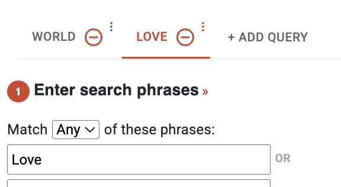

# Evan Suslovich's Take Home:

## Part 1: SQL Queries 

### Table for Part A
SQL code is in `/part1/partA`:

### Table for Part B
SQL code is in `/part1/partB`:

### Table for Part C
SQL code is in `/part1/partC`:

### Table for Part D
SQL code is in `/part1/partD`:

## Part 2: Data Visualization

The data visualizations for this part are implemented using the Jupyter notebook located at:

- **Data Visualization Code:** `/part2/task2.ipynb`

### Visualizations

My definition for "importance" is based on the number of bills referred to each committee. 
The more bills, the more "important" that committee is. 

Using this definition I found that the most "important" committee is the `House Committee on Ways and Means` with 16.0% of bills. 

Playing around with the data, I also found that the House of Reps. hold 68.1% of the committees and congress holds 31.9%.

After taking a second glance, I think I focused too much on the frequency of bills. 
While the number of bills is "important", I think what is more "important" is the
amount of money that is lobbied for each bill under the committees. If a committee has a small number 
of bills, 1-2% but an astronomical amount of money is lobbied for those bills, 10%, out of all the lobbied money, 
I think that committee is deemed "important", extremely important. 

My definition of "importance" took me down what I found was the 1st route:
Examine the frequency of bills by the most "important" committees using the congress. 
The vizualization I produced allows for the frequency of bills to be examined throughout the years.
However, it seems like the frequency is normally distributed for all the top committees. 

Using my refined definition of "importance", the 2nd route:
Using the `filings.csv`, we can examine the frequency of money spent under different
committees and identify the changes in spending patterns in committees. I believe following the "money" is a little more "important" than just the sheer quanitity of bills.
This process could have been made easier if joined the `filings.csv` with the `filing_bills.csv`, so each filing_uuid has it's bill_id associated with it. 

This wasn't my intitial definition of "importance" because looking at the filing dates, they were all very close in time, so I thought the time series data wasn't substantial enough. But in reality, this problem is also seen with different congresses.

-- 
The data we have, examines many aspects of "importance". What we don't have is the percentage of poltical difference in the committee. What may be more important is how unified the committee's thinking is. If a committee can work together to get bills pushed, their success rate for bills being passed in congress, may be higher. Data that can help could be in a sentiment anaylsis on the committee members' poltical alignment. This could provide insight into their cohesion or division, and help predict legislative effectiveness.

-- 
If I had more time:
I would love to create a Sankey diagram to visualize the flow from top contributing clients to registrants, then to the filings for bills, and finally to the bills in committees. This would offer a compelling visual representation of how client contributions potentially influence legislative outcomes through the policy pipeline. It would providing clarity into the complex lobbying dynamics.

# Part 3
https://github.com/mediacloud/web-search/blob/main/mcweb/frontend/src/features/search/util/tabTitles.js

This is a link to some code I wrote 2 years ago. While I've gained a ton of experience since writing this code I think my seperation of concerns and modular programming, along with testing, makes this a pretty solid 100LOC function. 

The idea behind this code is that when researchers make queries, each query should have it's own unique title. https://search.mediacloud.org/search, here you can play around with it. 

An example where this code is used: creating titles for tabs 

